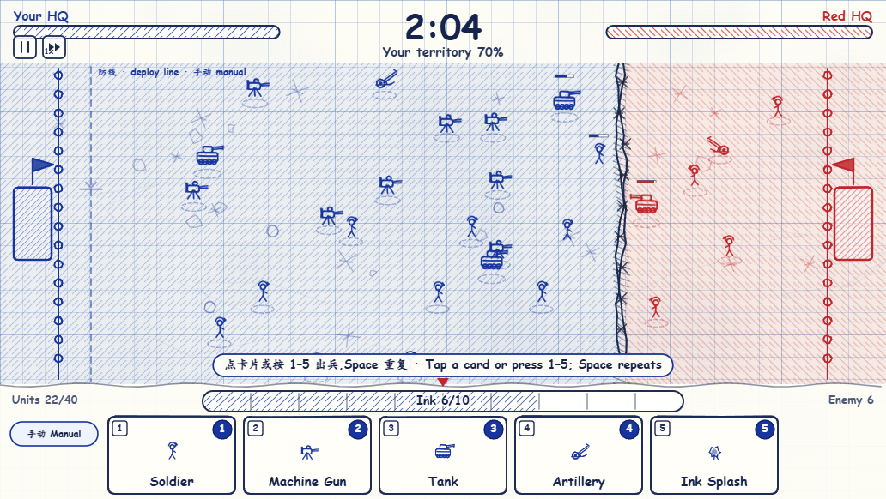
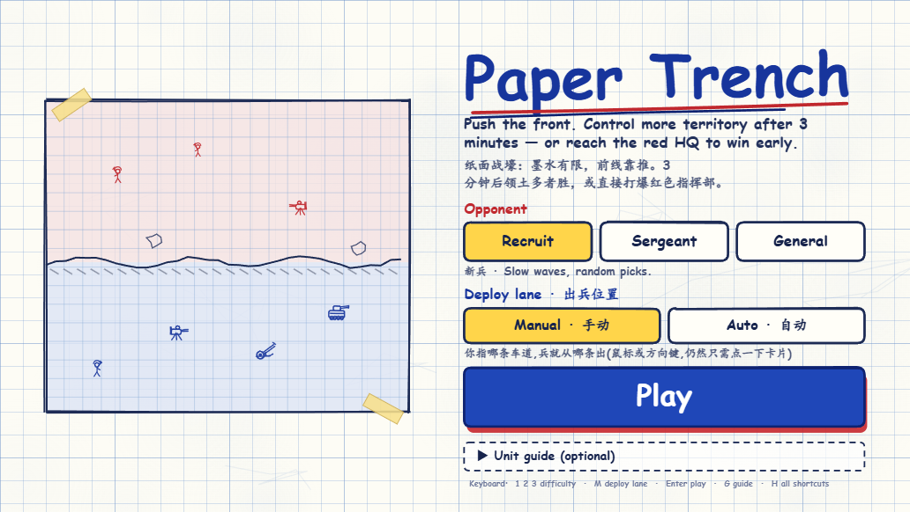
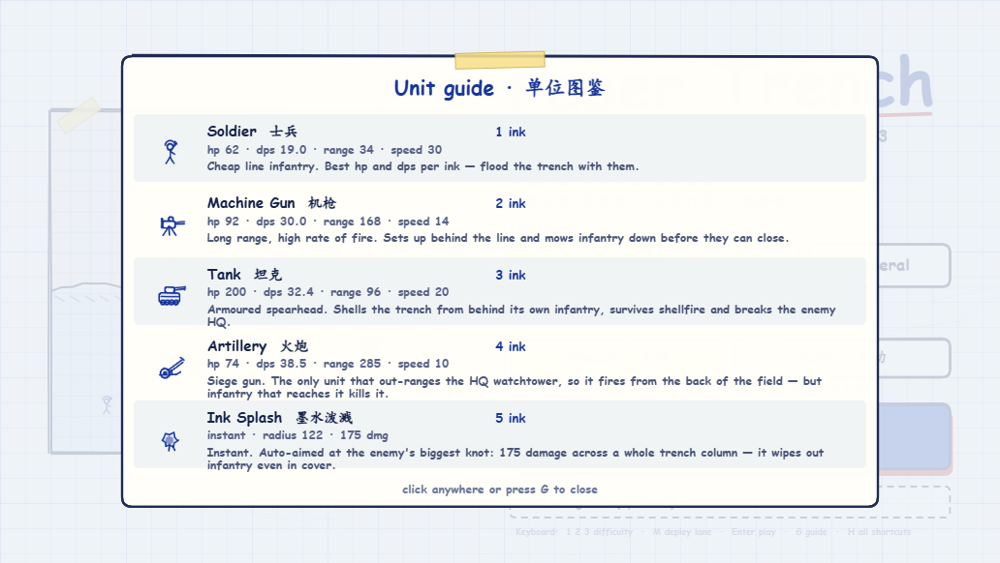
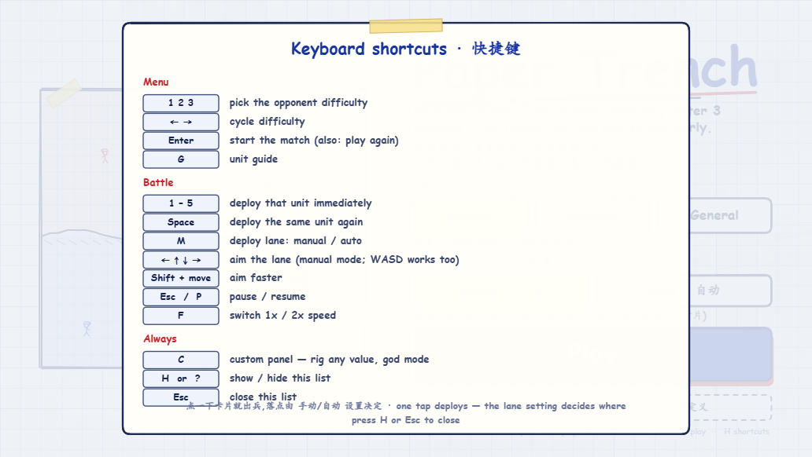

# Paper Trench · 纸面战壕

> 单文件 · 零依赖 · 零构建 —— 双击 HTML 就能玩的 Canvas 涂鸦风即时战略

### ▶ [**在线试玩 · Play in browser**](https://cn-ywcw.github.io/paper-trench/paper-trench.html)

一张方格纸，两支墨水笔。蓝墨水是你的部队，红墨水是敌人的。在 3 分钟内把前线推过去，抢下更多领土——或者直接把对面的红色指挥部打爆。



## 快速开始

不需要安装任何东西，不需要构建，不需要服务器。

**方式一 —— 在线玩：** 打开 <https://cn-ywcw.github.io/paper-trench/paper-trench.html>

**方式二 —— 本地玩：** 下载仓库后双击 `paper-trench.html`（或者直接把这个文件拷给别人）

游戏完全离线运行：所有美术都是 Canvas 2D 现画的，没有任何图片、字体或 CDN 依赖，所以单个 HTML 文件本身就是完整的游戏。

## 玩法

### 胜负条件

一局 3 分钟（180 秒），两种赢法：

- **领土判定** —— 时间耗尽时，占地在 50% 以上的一方获胜
- **斩首** —— 提前打爆敌方指挥部（HQ）直接取胜

指挥部有 3000 血，自带一座**瞭望塔**：195 范围内每 0.42 秒打出 15 点伤害。如果指挥部周围 175 范围内 4 秒没有敌人，它会以每秒 14 点回血。所以想强拆 HQ，得先把它的火力压住。

### 墨水

墨水是唯一的资源,上限 10 点，每秒回复 1.05 点。

**落后的一方回墨更快**：当你的领土占比低于 45% 时，墨水恢复速度会获得加成，最低谷时约为 1.7 倍。这是防止滚雪球的设计——被推到家门口不会直接崩盘。

如果部队已经满员（每方上限 40 个），出兵会失败并**不扣墨水**。

### 领土与减伤

战场被一条会实时移动的**前线**分成两块。补给线以内的土地就是你的领土。

**只有最前排会挨满伤害，后面的兄弟有掩体,受到的伤害减半。** 判定方式是看你离**自家最深入的部队**有多远:

- 每 8 个兵里有 1 个在最前面开路,它吃满伤害;身后的人减半
- 部队不足 8 人时没有"前排"可言,全员都在掩体里(所以单独一辆坦克或一门火炮不会被白打)
- 这条规则对双方完全一样

所以硬冲是要付学费的:顶在最前面的人先挨枪,后面跟上来的才有掩体。

### 前线

前线由双方**最深入的 3 个单位**的平均位置决定,哪边推得靠前,线就往对面爬。前线爬进对方外侧 24% 的"筑垒区"时速度会明显变慢,形成一个自然的攻坚阻力。

**但前线同时是一条硬边界:任何单位都不会站到线的另一边。** 线会跟着最前面的部队走——如果线落在你部队后面,那支部队就等于站在界外了,所以线永远不低于(也不高于)双方最深入的那个单位。实测整局下来越线距离是 0 像素。

## 单位

点一下底部的卡片，部队就已经上路了——**只需要点一下**，不需要再点战场。部队统一从自家**防线**出发，车道由下面的「出兵位置」设置决定。

### 出兵位置：手动 / 自动（可切换）

菜单里选一次，对局中随时按 `M` 或点左下角的小胶囊也能切：

| 设置 | 车道由谁决定 | 怎么用 |
|---|---|---|
| **手动 Manual** | 你 | 把鼠标移到想出兵的那条车道（方向键 / WASD 也行），屏幕上的虚线箭头和半透明预览就是落点，然后点卡片或按 `1`–`5` |
| **自动 Auto** | 系统 | 你只管点卡片；系统按战场局势挑车道（补向敌人推进最狠的位置，并避开已经扎堆的地方） |

两种模式都**不需要第二次点击**：点卡片就是出兵，手动模式只是把"鼠标停在哪"当作车道，所以指针移到下面的卡片上时，车道还是你刚才指的那条。

墨水泼溅在手动模式下会精确落在你指的位置（会画出将被泼中的整条战壕纵列）；自动模式下则自动瞄准敌人最密集的一团。

| 单位 | 墨水 | 生命 | 伤害 | 攻击间隔 | 射程 | 速度 | 定位 |
|---|---|---|---|---|---|---|---|
| 士兵 Soldier | 1 | 62 | 11 | 0.58s | 34 | 30 | 最省墨的线列步兵，必须贴上去打，靠数量平推 |
| 机枪 Machine Gun | 2 | 92 | 6 | 0.20s | 168 | 14 | 在步兵线后面架枪，射速快、压制成群步兵 |
| 坦克 Tank | 3 | 200 | 34 | 1.05s | 96 | 20 | 在自己的步兵身后开炮，重甲、能扛炮弹、拆 HQ |
| 火炮 Artillery | 4 | 74 | 100 | 2.6s | 285 | 10 | 唯一的攻城炮，蹲在战场最后方，射程超过 HQ 瞭望塔（285 > 195），但被近身就死 |
| 墨水泼溅 Ink Splash | 5 | — | 175 | 瞬发 | 半径 122 | — | 对整条战壕纵列造成伤害，即使敌人站在自己领土上也照打 |

**射程 = 站位。** 单位只要有目标在射程内就会停下来开火，所以射程越长站得越靠后：士兵顶在最前面，机枪和坦克在步兵线后面，火炮蹲在最后。你不用手动拉扯阵型，它们自己会排成有纵深的梯队。

单位之间存在刻意的**克制三角**，不是数值越大越强：

- **士兵** 最省墨，靠数量能吃掉坦克和火炮，但要一路挨打才能贴上去
- **机枪** 撕碎步兵人海，而且步兵得先跑完 168 的距离
- **坦克** 在 96 的距离上砸机枪，但机枪的 168 让它先挨几轮
- **火炮** 拆重甲、拆基地，是全队唯一能打到瞭望塔的，但怕被近身
- **墨水泼溅** 是应对抱团推进的答案

## 难度

| 难度 | 思考间隔 | 回墨 | 出兵波次 | 数值 | 策略 |
|---|---|---|---|---|---|
| 新兵 Recruit | 2.4s | 0.34/s | 9 | ×0.90 | 出兵慢，随机选兵 |
| 中士 Sergeant | 1.5s | 0.56/s | 6 | ×1.00 | 稳定施压，会读你的阵容 |
| 将军 General | 0.95s | 0.80/s | 5 | ×1.06 | 又快又狠，针对性反制、集火 |

AI 会真的"看"你的部队组成：它会数你场上有多少坦克、多少步兵，然后挑克制你的兵种，并且会在你扎堆时用墨水泼溅洗地。将军还会优先集火你的火炮。

## 键盘快捷键

鼠标能做的，键盘都能做——纯键盘可以完整打完整局。

| 场景 | 按键 | 作用 |
|---|---|---|
| 菜单 | `1` `2` `3` | 选择难度 |
| | `←` `→` | 循环切换难度 |
| | `Enter` | 开始游戏 |
| | `M` | 切换 手动 / 自动 出兵位置 |
| | `G` | 打开单位图鉴 |
| 对局 | `1` – `5` | 立即出兵（对应卡片序号） |
| | `Space` | 重复上一次出兵，可以按住连点 |
| | `M` | 切换 手动 / 自动 出兵位置 |
| | `←↑↓→` / `WASD` | 瞄准车道（仅手动模式；自动模式下按了会提示） |
| | `Shift` + 方向 | 瞄得更快 |
| | `Esc` / `P` | 暂停 / 继续 |
| | `F` | 1× / 2× 速度切换 |
| 通用 | `H` 或 `?` | 快捷键面板（自动暂停对局） |
| | `Esc` | 关闭面板 |

战场上那条虚线就是**防线**，线上的箭头标出下一次出兵会走哪条车道，每次出兵都会在原地画一个圈作为反馈。手动模式下还会显示待部署单位的半透明预览；选中墨水泼溅时会显示将被泼中的整条战壕纵列。

> 两种模式都没有"第二次点击"：点卡片就是出兵。手动模式记的是**鼠标最后停在战场上的位置**，所以指针移到卡片上时车道不会跑掉，也不会因为手抖把兵丢在角落。

## 截图

| 主菜单 | 单位图鉴 |
|---|---|
|  |  |



## 技术说明

- **单文件**：整个游戏是 `paper-trench.html` 一个文件，无 `src` / `href` / 网络请求
- **纯 Canvas 2D**：手绘涂鸦风格靠带种子的伪随机抖动（`mulberry32`）实现，保证笔触不会逐帧乱抖
- **ES5**：不使用箭头函数、模板字符串、`let` / `const`，兼容性拉到最宽
- **无构建、无依赖、无框架**
- 单位贴图按 `类型|阵营` 缓存预渲染，红军直接镜像蓝军贴图
- 战斗沿 x 轴一维结算；溅射则刻意把 y 轴压扁，保证任意窗口比例下都能覆盖整条战壕纵列
- 界面统一按 `L.ui = clamp(min(W/1032, H/582), 0.62, 1.55)` 缩放，从窄屏手机到宽屏都能正常显示

### 平衡性

单位强度用 `Q = 生命 × 每秒伤害 / 墨水²` 衡量，目标是把各单位的 Q 值拉到同一量级，让**等量墨水的两支部队能打得有来有回**。

## 项目结构

```
paper-trench.html      游戏本体（唯一交付物）
AGENTS.md              给 AI 协作者的工程约定与调试记录
README.md
preview-menu.png       截图
preview-gameplay.png
preview-guide.png
preview-hotkeys.png
```

## English

**Paper Trench** is a single-file, zero-dependency browser RTS drawn in a graph-paper
doodle style. Blue ink is you, red ink is the enemy.

- **Play online:** <https://cn-ywcw.github.io/paper-trench/paper-trench.html> — or open
  `paper-trench.html` locally; no build step, no server, no network
- A match lasts **3 minutes**. Win by holding **more than 50% of the territory** at time
  up, or by **destroying the red HQ** early
- **Ink** is the only resource (cap 10). **One click on a card deploys** — there is never
  a second click on the battlefield. The deploy lane is a setting: **Manual** (point at
  the lane with the mouse or the arrow keys) or **Auto** (the game reads the fight and
  picks), switchable from the menu or with `M`
- You take **50% less damage behind your own front rank** — one unit in eight is in the
  open and takes full damage, and a force under eight is entirely dug in (so a lone tank
  is never punished for being alone). True for both sides
- The front line moves in real time, driven by the three deepest units of each army — and
  it is a **hard boundary**: the line always keeps up with the deepest unit on either
  side, so no unit ever stands on the wrong side of it
- **Range is position.** A unit stops the moment it has a target in range, so soldiers
  hold the front while MGs, tanks and artillery form up behind them — no babysitting
- **5 units** with an intentional counter-triangle (soldiers swarm, MGs shred infantry,
  tanks shell MGs from 96 away, artillery out-ranges everything including the HQ
  watchtower, Ink Splash answers clumped pushes)
- **3 AI difficulties**; the AI reads your army composition and counter-picks
- Full keyboard support: play an entire match without a mouse (`H` lists every shortcut)

Built with plain ES5 and Canvas 2D. All art is drawn at runtime — there are no image,
font, or CDN dependencies anywhere in the file.
